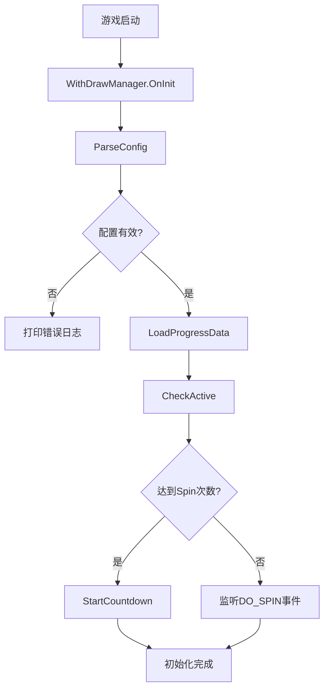
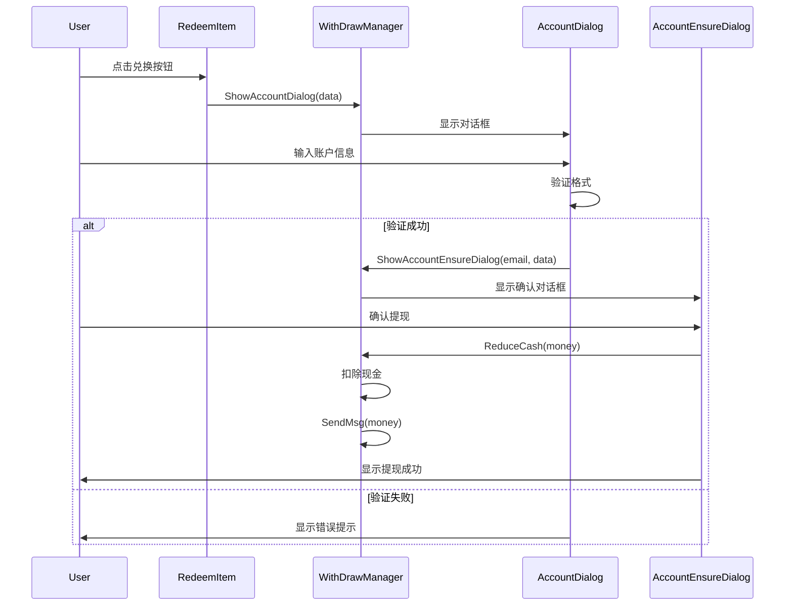
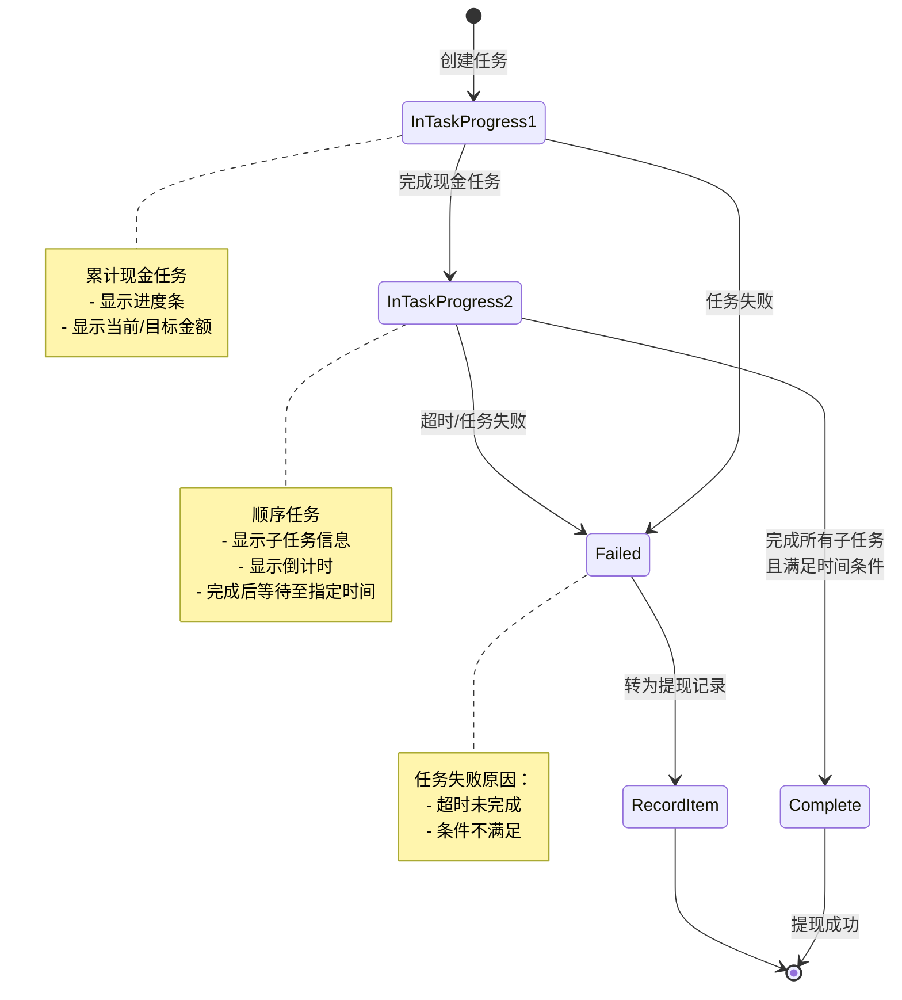

# WithDraw 模块技术文档

## 目录

- [模块概述](#模块概述)
- [核心功能](#核心功能)
- [架构设计](#架构设计)
  - [模块结构](#模块结构)
  - [类图关系](#类图关系)
  - [设计模式](#设计模式)
- [核心类详解](#核心类详解)
  - [WithDrawManager](#withdrawmanager)
  - [RedeemItemData](#redeemitemdata)
  - [RecordItemData](#recorditemdata)
  - [UI组件](#ui组件)
- [业务流程](#业务流程)
  - [初始化流程](#初始化流程)
  - [提现流程](#提现流程)
  - [任务状态转换](#任务状态转换)
- [配置系统](#配置系统)
- [消息通信](#消息通信)
- [使用指南](#使用指南)
- [API 参考](#api-参考)
- [已知问题与注意事项](#已知问题与注意事项)

---

## 模块概述

**WithDraw（提现）模块** 是一个完整的任务奖励系统，用户通过完成指定任务积累虚拟现金，达到条件后可以进行提现操作。

### 模块位置
```
Assets/Scripts/System/WithDraw/
```

### 技术栈
- **Unity**: 游戏引擎
- **C#**: 编程语言
- **DOTween**: 动画库
- **UniRx/UniTask**: 异步操作
- **Addressables**: 资源管理
- **LoopScrollRect**: 虚拟滚动列表

### 版本信息
- **当前版本**: 1.0
- **最后更新**: 2025-12-17

---

## 核心功能

### 1. 多平台提现支持
- 支持多个第三方支付平台（PayPal、Google Pay等）
- 平台图标动态加载
- 平台切换 Toggle 界面

### 2. 两阶段任务系统
#### 第一阶段：累计现金任务
- 任务类型：`AccumulateTotalCashTask`
- 目标：累积指定数量的虚拟现金
- 显示：进度条 + 当前/目标金额

#### 第二阶段：顺序任务
- 任务类型：`SequentialTask`
- 包含多个子任务，按顺序完成
- 每个子任务有时间限制
- 显示：子任务信息 + 倒计时

### 3. 提现限制机制
#### 冷却时间模式
- 完成提现后进入冷却期
- 冷却时间可配置（秒）

#### 登录天数模式
- 需要累计登录指定天数
- 每天首次登录计数 +1

### 4. 账户信息验证
- 邮箱格式验证（Google Pay、PayPal）
- 手机号格式验证（其他平台）
- 最小长度要求：6位

### 5. 广告系统集成
- 关闭提现界面时播放插屏广告
- Spin 次数激活机制
- 广告冷却时间控制

### 6. 提现记录管理
- 失败/超时任务转为提现记录
- 显示集卡进度
- 记录数据持久化

### 7. 数据埋点
- 提现次数统计
- 提现平台记录
- 提现金额记录

---

## 架构设计

### 模块结构

```
WithDraw/
├── Core/                           # 核心逻辑
│   ├── WithDrawManager.cs          # 核心管理器（单例）
│   ├── WithDrawConstants.cs        # 常量定义
│   └── WithDrawSystemProgressData.cs # 进度数据持久化
│
├── Data/                           # 数据模型
│   ├── RedeemItemData.cs           # 兑换任务数据
│   └── RecordItemData.cs           # 提现记录数据
│
└── UI/                             # UI组件
    ├── Dialogs/                    # 对话框
    │   ├── WithDrawDialog.cs       # 主对话框
    │   ├── AccountDialog.cs        # 账户输入
    │   ├── AccountEnsureDialog.cs  # 确认对话框
    │   ├── AccountLoginTipsDialog.cs # 登录提示
    │   ├── WithDrawTipDialog.cs    # 提现提示
    │   └── WithDrawTaskCompletePanel.cs # 任务完成
    │
    ├── Panels/                     # 面板
    │   ├── WithDrawRedeemPanelItem.cs # 兑换面板
    │   └── WithDrawRecordPanelItem.cs # 记录面板
    │
    └── Items/                      # 列表项
        ├── RedeemItem.cs           # 兑换项
        └── RecordItem.cs           # 记录项
```

### 类图关系

```
┌─────────────────────────┐
│   WithDrawManager       │ (单例)
│   - redeemItemDict      │
│   - recordItemDict      │
│   - progressData        │
└───────┬─────────────────┘
        │
        ├─────────┬─────────┬─────────┐
        │         │         │         │
        ▼         ▼         ▼         ▼
┌──────────┐ ┌──────────┐ ┌──────────┐ ┌──────────┐
│ Redeem   │ │ Redeem   │ │ Record   │ │Progress  │
│ItemData  │ │ItemData  │ │ItemData  │ │Data      │
└────┬─────┘ └────┬─────┘ └────┬─────┘ └──────────┘
     │            │            │
     ▼            ▼            ▼
┌──────────┐ ┌──────────┐ ┌──────────┐
│ Redeem   │ │ Redeem   │ │ Record   │
│ Item UI  │ │ Item UI  │ │ Item UI  │
└──────────┘ └──────────┘ └──────────┘
     │            │            │
     └────────────┴────────────┘
                  │
                  ▼
        ┌──────────────────┐
        │  WithDrawDialog  │
        └──────────────────┘
```

### 设计模式

#### 1. 单例模式 (Singleton)
```csharp
// WithDrawManager.cs:38-42
public static WithDrawManager Instance
{
    get { return Singleton<WithDrawManager>.Instance; }
}
```
**用途**: 确保全局只有一个管理器实例

#### 2. 观察者模式 (Observer)
```csharp
// RedeemItemData.cs:61-63
SequentialTask.OnProgressUpdated += OnSequentialTaskProgressUpdated;
SequentialTask.OnTaskCompleted += OnSequentialTaskCompleted;
SequentialTask.OnSwitchChildTask += OnSwitchChildTask;
```
**用途**: 任务状态变化通知UI更新

#### 3. 对象池模式 (Object Pool)
```csharp
// WithDrawRedeemPanelItem.cs:36
PoolResourceManager.Instance.InitPool(poolName, itemPrefab, 5);
```
**用途**: 复用列表项，减少GC压力

#### 4. 策略模式 (Strategy)
```csharp
// AccountDialog.cs:81-92
// 不同平台使用不同的验证策略
if (platformIndex == 6 || platformIndex == 8)
    return IsEmail(account);
return IsValidNumberString(account);
```
**用途**: 不同平台的账户验证规则

#### 5. MVC模式
- **Model**: RedeemItemData, RecordItemData
- **View**: RedeemItem, RecordItem
- **Controller**: WithDrawManager

---

## 核心类详解

### WithDrawManager

**文件**: `WithDrawManager.cs:13`
**类型**: 单例管理器
**职责**: 提现系统的核心控制器

#### 关键属性

| 属性 | 类型 | 说明 |
|------|------|------|
| `CurSelectTaskId` | int | 当前选中的任务ID |
| `coolTime` | int | 冷却时间（秒）或登录天数（负数） |
| `CanPlayAd` | bool | 是否可以播放关闭广告 |
| `isFirstWithDraw` | bool | 是否首次提现 |
| `WithDrawUIShow` | static bool | 提现UI是否显示 |
| `NeedLoginDays` | bool | 是否需要累计登录天数 |
| `redeemItemDict` | Dictionary | 兑换任务数据字典 |
| `recordItemDict` | List | 提现记录列表 |

#### 核心方法

##### 初始化
```csharp
public void OnInit()
```
**功能**:
1. 解析配置 `ParseConfig()`
2. 加载进度数据 `LoadProgressData()`
3. 检查广告激活 `CheckActive()`
4. 启动广告冷却倒计时

**调用时机**: 游戏启动时

##### 配置解析
```csharp
public void ParseConfig()
```
**功能**:
1. 从配置系统读取 `WithDrawPanelConfig`
2. 解析冷却时间、广告配置
3. 根据平台创建兑换任务列表
4. 筛选已完成任务创建记录

**配置键**: `WithDrawPanelConfig`

##### 数据访问
```csharp
// 获取兑换项数量
public int GetRedeemItemCount(int index)

// 获取兑换项数据
public RedeemItemData GetRedeemItemData(int index)

// 获取记录项数量
public int GetRecordItemCount()

// 获取记录项数据
public RecordItemData GetRecordItemIndex(int index)
```

##### 登录天数管理
```csharp
// 保存任务完成时间
private void SaveTaskFinishTime(int taskId)

// 获取登录天数
public int GetLoginDays(int taskId)

// 更新登录天数（每日首次调用 +1）
public int UpDateLoginDays(int taskId)

// 判断是否新一天登录
private bool IsNewDayLogin(string key)
```

**存储**: 使用 PlayerPrefs 存储
- `TaskFinishTime{taskId}`: 上次登录日期
- `LoginDays{taskId}`: 累计登录天数

##### 对话框控制
```csharp
// 显示账户输入对话框
public void ShowAccountDialog(RedeemItemData data)

// 显示账户确认对话框
public void ShowAccountEnsureDialog(string email, RedeemItemData data)

// 显示提现主对话框
public void ShowWithDrawDialog()

// 关闭提现对话框
public void CloseWithDrawDialog()
```

##### 现金操作
```csharp
public void ReduceCash(int money)
```
**功能**:
1. 扣除用户现金
2. 广播现金变化消息
3. 保存任务完成时间（如需要登录天数）

**注意**: ⚠️ 此操作在客户端执行，建议添加服务器验证

##### 广告管理
```csharp
// 开始广告冷却倒计时
public void StartCountdown()

// 检查广告激活状态
private void CheckActive()
```

**激活条件**: 累计 Spin 次数 >= `_activeAdSpinCount`
**冷却时间**: `_adCoolTime` 秒

##### 埋点上报
```csharp
public void SendMsg(int money)
```
**上报数据**:
```json
{
  "count": 1,          // 提现次数
  "platform": 0,       // 平台索引
  "cash": 1000         // 提现金额
}
```

**事件名**: `Redeem`

---

### RedeemItemData

**文件**: `RedeemItemData.cs:18`
**类型**: 数据模型
**职责**: 管理单个提现任务的状态和逻辑

#### 状态枚举
```csharp
public enum RedeemItemState
{
    InTaskProgress1 = 0,  // 第一阶段：累计现金任务
    InTaskProgress2,      // 第二阶段：顺序任务
    Complete,             // 完成（可提现）
    Failed                // 失败（转为记录）
}
```

#### 状态转换图
```
[InTaskProgress1] ─── 完成现金任务 ──→ [InTaskProgress2]
       │                                      │
       │                                      ├── 完成所有子任务 → [Complete]
       │                                      │
       └────────────── 任务失败/超时 ─────────┴──→ [Failed]

```

#### 关键属性

| 属性 | 类型 | 说明 |
|------|------|------|
| `state` | RedeemItemState | 当前状态 |
| `itemUI` | RedeemItem | 绑定的UI组件 |
| `CashTask` | AccumulateTotalCashTask | 累计现金任务 |
| `SequentialTask` | SequentialTask | 顺序任务 |
| `SequentialChildTask` | SequentialTask | 当前子任务 |
| `CurTask` | BaseTask | 当前正在执行的任务 |
| `index` | int | 档位索引 |
| `platSpIndex` | int | 平台图标索引 |
| `RewardCash` | int | 奖励现金数量 |

#### 生命周期

##### 构造函数
```csharp
public RedeemItemData(Dictionary<string,object> config)
```
**执行步骤**:
1. 解析配置获取 `index`、`rewardCash`
2. 解析 `taskConfig` 列表
3. 注册 `AccumulateTotalCashTask`
4. 注册 `SequentialTask`
5. 绑定任务事件监听器

##### UI绑定
```csharp
// 初始化并绑定UI
public void OnInit(RedeemItem item)

// 绑定UI组件
public void BindUI(RedeemItem item)

// 解绑UI组件
public void UnBindUI()
```

#### 核心方法

##### 状态更新
```csharp
public void UpdateState()
```
**逻辑**:
```
if CashTask.State == ONGOING:
    → state = InTaskProgress1
else if SequentialTask.State == ONGOING:
    → state = InTaskProgress2
    → 绑定子任务事件
else:
    → state = Complete
```

##### 任务切换
```csharp
public void SwitchToNextTask()
```
**触发时机**: 第一阶段任务完成
**执行步骤**:
1. 完成 `CashTask`
2. 激活 `SequentialTask` 的子任务
3. 更新状态为 `InTaskProgress2`
4. 绑定子任务事件

##### 事件处理

```csharp
// 顺序任务进度更新
private void OnSequentialTaskProgressUpdated(BaseTask task, int progress)

// 子任务完成
private void OnSequentialTaskChildTaskCompleted(BaseTask childTask)

// 切换子任务
private void OnSwitchChildTask(BaseTask task, int childIndex)

// 顺序任务完成（全部子任务完成/失败）
private void OnSequentialTaskCompleted(BaseTask task)

// Spin 结束事件
void OnSpinEnd()
```

##### 提现失败处理
```csharp
public void WithDrawFailed()
```
**执行步骤**:
1. 转换为 `RecordItemData`
2. 从兑换列表移除
3. 添加到记录列表
4. 广播更新消息

**触发时机**:
- 顺序任务全部完成（超时）
- 任务条件不满足

---

### RecordItemData

**文件**: `RecordItemData.cs:9`
**类型**: 数据模型
**职责**: 存储已完成或失败的提现记录

#### 关键属性

| 属性 | 类型 | 说明 |
|------|------|------|
| `itemUI` | RecordItem | 绑定的UI组件 |
| `index` | int | 索引 |
| `platSpIndex` | int | 平台图标索引 |
| `curProgress` | int | 当前进度（已收集卡片类型数） |
| `targetProgress` | int | 目标进度（总卡片类型数） |
| `cash` | int | 现金金额 |
| `taskId` | int | 任务ID |

#### 主要方法

```csharp
// 初始化
public void OnInit(RecordItem item)

// 绑定UI
public void BindUI(RecordItem item)

// 解绑UI
public void UnBindUI()
```

---

### UI组件

#### WithDrawDialog
**文件**: `WithDrawDialog.cs:17`
**类型**: UIDialog
**职责**: 提现主对话框，管理兑换和记录两个面板

**UI结构**:
```
WithDrawDialog
├── Header
│   ├── money (TextMeshProUGUI)     # 当前现金
│   └── taskInfo (TextMeshProUGUI)  # 任务信息
├── Tabs
│   ├── redeemToggle (Toggle)       # 兑换页签
│   └── recordToggle (Toggle)       # 记录页签
├── Panels
│   ├── panelRedeem                 # 兑换面板
│   └── panelRecord                 # 记录面板
├── Tip
│   ├── tip (GameObject)            # 提示容器
│   └── tipInfo (TextMeshProUGUI)   # 提示文本
└── closeBtn (Button)               # 关闭按钮
```

**主要功能**:
- 页签切换（兑换/记录）
- 现金数量显示
- 提示消息动画
- 广告播放控制

---

#### WithDrawRedeemPanelItem
**文件**: `WithDrawRedeemPanelItem.cs:10`
**类型**: MonoBehaviour
**职责**: 兑换面板，显示可提现任务列表

**功能**:
- 多平台切换（Toggle组）
- 虚拟滚动列表（LoopScrollRect）
- 对象池管理

**实现接口**:
- `LoopScrollPrefabSource`: 提供列表项预制体
- `LoopScrollDataSource`: 提供列表项数据

**关键方法**:
```csharp
// 获取对象（从对象池）
public GameObject GetObject(int index)

// 归还对象（到对象池）
public void ReturnObject(Transform trans)

// 提供数据
public void ProvideData(Transform transform, int idx)
```

---

#### RedeemItem
**文件**: `RedeemItem.cs:13`
**类型**: MonoBehaviour
**职责**: 单个兑换任务的UI表现

**UI元素**:
```csharp
public TextMeshProUGUI cashTMP;              // 现金金额
public TextMeshProUGUI taskTimeCor;          // 倒计时
public Image paltformImg;                    // 平台图标
public Button redeemBtn;                     // 兑换按钮
public RectTransform inProgress;             // 进行中UI
public RectTransform condition;              // 条件UI
public TextMeshProUGUI progressTMP;          // 进度文本
public Image progressBar;                    // 进度条
public TextMeshProUGUI conditionTMP;         // 条件文本
public Image taskIconImg;                    // 任务图标
public GameObject sequentialTaskObj;         // 顺序任务对象
public TextMeshProUGUI sequentialTaskProgressTMP; // 顺序任务进度
public Button sequentialTaskBtn;             // 顺序任务按钮
```

**状态显示**:
- **InTaskProgress1**: 显示现金收集进度条
- **InTaskProgress2**: 显示子任务信息和倒计时
- **Complete**: 显示兑换按钮

**协程**:
```csharp
// 倒计时协程
private IEnumerator Co_UpdateSequentialTime(TextMeshProUGUI CountDownText, BaseTask childTask)
```
每秒更新一次倒计时显示，时间到时自动完成任务。

---

#### AccountDialog
**文件**: `AccountDialog.cs:12`
**类型**: UIDialog
**职责**: 账户信息输入对话框

**UI元素**:
```csharp
public Image image;                    // 平台图标
public TMP_InputField inputField;      // 输入框
public Button ensureBtn;               // 确认按钮
public GameObject notice;              // 错误提示
```

**验证规则**:
```csharp
// 邮箱验证（Google Pay、PayPal）
if (platformIndex == 6 || platformIndex == 8)
    return IsEmail(account);

// 手机号验证（其他平台）
return IsValidNumberString(account);
```

**正则表达式**:
- **邮箱**: `^[A-Za-z0-9._%+-]+@[A-Za-z0-9.-]+\.[A-Za-z]{2,}$`
- **手机号**: `^\d{6,}$`（至少6位数字）

---

#### AccountEnsureDialog
**文件**: `AccountEnsureDialog.cs:11`
**类型**: UIDialog
**职责**: 账户确认对话框

**UI元素**:
```csharp
public TextMeshProUGUI cashTmp;        // 现金金额
public Image image;                    // 平台图标
public TextMeshProUGUI emailTMP;       // 账户信息
public TextMeshProUGUI dataTmp;        // 日期
public Button ensureBtn;               // 确认按钮
```

**确认流程**:
1. 防止重复点击（`btnClick` 标志）
2. 关闭对话框
3. 广播更新兑换项状态
4. 扣除现金 `ReduceCash()`
5. 检查并显示提现提示
6. 发送埋点 `SendMsg()`
7. 广播完成提现操作

---

## 业务流程

### 初始化流程



**详细步骤**:

1. **解析配置** (`ParseConfig`)
   ```
   读取 WithDrawPanelConfig
   ├── 解析 coolTime（冷却时间/登录天数）
   ├── 解析 AdCoolTime（广告冷却时间）
   ├── 解析 ActiveAdSpinCount（激活广告所需Spin次数）
   └── 解析 ItemConfig
       └── 遍历平台配置
           ├── 创建 RedeemItemData
           ├── 已完成任务 → recordItemDict
           └── 未完成任务 → redeemItemDict
   ```

2. **加载进度数据** (`LoadProgressData`)
   ```
   从本地读取 WithDrawSystemProgressData.json
   ├── isFirstWithDraw（是否首次提现）
   ├── FreeSymbolNum
   └── S01SymbolNum
   ```

3. **检查广告激活** (`CheckActive`)
   ```
   获取累计 Spin 次数
   if Spin次数 >= ActiveAdSpinCount:
       _isActiveCloseAd = true
       StartCountdown()  // 启动广告冷却倒计时
   else:
       监听 DO_SPIN 事件
   ```

---

### 提现流程



**详细步骤**:

1. **打开提现对话框**
   ```
   用户点击入口
   └── WithDrawManager.ShowWithDrawDialog()
       └── Messenger.Broadcast(OpenWithDrawDialog)
           └── WithDrawDialog 显示
               ├── 默认显示兑换面板
               └── 加载任务列表
   ```

2. **选择任务**
   ```
   用户选择平台
   └── WithDrawRedeemPanelItem.OnValueChanged()
       ├── 设置 PlatFormIndex
       └── 刷新列表
           └── 显示对应平台的任务
   ```

3. **查看任务详情**
   ```
   RedeemItem 显示任务信息
   ├── InTaskProgress1（累计现金）
   │   ├── 显示进度条
   │   ├── 当前金额/目标金额
   │   └── 任务图标
   │
   └── InTaskProgress2（顺序任务）
       ├── 显示子任务信息
       ├── 显示倒计时
       └── 显示总进度
   ```

4. **点击兑换按钮**
   ```
   RedeemItem.OnButtonClickHandler()
   └── WithDrawManager.ShowAccountDialog(itemData)
       └── AccountDialog 显示
           └── 加载平台图标
   ```

5. **输入账户信息**
   ```
   用户输入账户
   └── 点击确认
       └── AccountDialog.CheckAccountValid()
           ├── Google Pay/PayPal → 验证邮箱
           └── 其他平台 → 验证手机号
   ```

6. **确认提现**
   ```
   AccountEnsureDialog 显示
   ├── 显示平台图标
   ├── 显示现金金额
   ├── 显示账户信息
   └── 显示日期

   用户点击确认
   └── AccountEnsureDialog.EnsureBtnClick()
       ├── 防止重复点击（btnClick = true）
       ├── 广播更新状态 UpdateRedeemItemState
       ├── 扣除现金 ReduceCash()
       ├── 检查显示提示 CheckShowWithDrawTipDialog()
       ├── 发送埋点 SendMsg()
       └── 广播完成提现 DoneWithDrawAction
   ```

7. **扣除现金**
   ```
   WithDrawManager.ReduceCash(money)
   ├── 计算新现金 = 当前现金 - 提现金额
   ├── 更新现金 OnLineEarningMgr.SetCash()
   ├── 广播现金变化 OnCashChangeForDisPlay
   └── 如需登录天数：SaveTaskFinishTime()
   ```

8. **发送埋点**
   ```
   WithDrawManager.SendMsg(money)
   ├── 读取提现次数 count = PlayerPrefs.GetInt("Redeem")
   ├── 次数 +1
   ├── 构建数据 {count, platform, cash}
   └── 上报平台 PlatformManager.SendMsg("Redeem")
   ```

---

### 任务状态转换



**状态说明**:

#### InTaskProgress1（累计现金任务）
**条件**: `CashTask.State == ONGOING`
**显示**:
```
┌─────────────────────────┐
│ [平台图标] $10.00       │
│                         │
│ [任务图标] ████░░░ 80%  │
│ $8.00 / $10.00         │
└─────────────────────────┘
```

**转换条件**:
- 完成 → `InTaskProgress2`: 现金达到目标
- 失败 → `Failed`: 任务异常

#### InTaskProgress2（顺序任务）
**条件**: `SequentialTask.State == ONGOING`
**显示**:
```
┌─────────────────────────┐
│ Day 1/3                 │
│ 23:45:32 倒计时         │
│                         │
│ Spin 10次 (5/10) ░░░░░ │
│                         │
│ [信息按钮]              │
└─────────────────────────┘
```

**子任务类型**:
- Spin 任务
- 收集道具任务
- 等待时间任务

**转换条件**:
- 完成 → `Complete`: 所有子任务完成且时间到达
- 失败 → `Failed`: 超时或任务失败

#### Complete（完成）
**条件**: 所有任务完成
**显示**:
```
┌─────────────────────────┐
│ [平台图标] $10.00       │
│                         │
│ [兑换按钮]              │
└─────────────────────────┘
```

**操作**: 点击兑换按钮开始提现流程

#### Failed（失败）
**触发**: `SequentialTask.OnTaskCompleted`
**处理**:
```
RedeemItemData.WithDrawFailed()
├── 转换为 RecordItemData
├── 从 redeemItemDict 移除
├── 添加到 recordItemDict
└── 广播 UpdateRedeemItemMsg
```

**显示**（在记录面板）:
```
┌─────────────────────────┐
│ [平台图标] $10.00       │
│                         │
│ 收集卡片 ████░░░ 80%   │
│ 16 / 20                │
│                         │
│ [兑换按钮]（需完成卡片）│
└─────────────────────────┘
```

---

## 配置系统

### 配置结构

**配置键**: `WithDrawPanelConfig`
**获取方式**: `Plugins.Configuration.GetInstance().GetValue()`

```json
{
  "coolTime": 86400,
  "AdCoolTime": 3600,
  "ActiveAdSpinCount": 100,
  "ItemConfig": {
    "Platform0": [
      {
        "index": 0,
        "rewardCash": 1000,
        "taskConfig": [
          {
            "taskId": 100,
            "taskType": 1,
            "targetNum": 5000
          },
          {
            "taskId": 101,
            "taskType": 2,
            "durationTime": 86400,
            "childTasks": [...]
          }
        ]
      }
    ],
    "Platform1": [...],
    "Platform2": [...]
  }
}
```

### 配置参数详解

#### 全局配置

| 参数 | 类型 | 说明 | 示例 |
|------|------|------|------|
| `coolTime` | int | 冷却时间（秒）<br/>负数表示登录天数 | `86400`（24小时）<br/>`-7`（7天） |
| `AdCoolTime` | int | 广告冷却时间（秒） | `3600`（1小时） |
| `ActiveAdSpinCount` | int | 激活广告所需Spin次数 | `100` |

**coolTime 说明**:
```csharp
// WithDrawManager.cs:206-210
if (coolTime < 0)
{
    NeedLoginDays = true;
    coolTime = -coolTime;  // 转为正数
}
```

- **正数**: 冷却时间模式，完成提现后需等待指定秒数
- **负数**: 登录天数模式，需累计登录指定天数

#### 任务配置

**ItemConfig** 结构:
```
ItemConfig
└── Platform{N}  (N = 0, 1, 2, ...)
    └── Array of Task
        ├── index (档位索引)
        ├── rewardCash (奖励金额)
        └── taskConfig (任务配置数组)
            ├── Task 1 (AccumulateTotalCashTask)
            └── Task 2 (SequentialTask)
```

**单个任务配置**:
```json
{
  "index": 0,
  "rewardCash": 1000,
  "taskConfig": [
    {
      "taskId": 100,
      "taskType": 1,        // TaskConstants.AccumulateCashTask_Key
      "targetNum": 5000
    },
    {
      "taskId": 101,
      "taskType": 2,        // TaskConstants.SequentialTask_Key
      "durationTime": 259200,
      "childTasks": [
        {
          "taskId": 102,
          "taskType": 2,
          "durationTime": 86400,
          "childTasks": [
            {
              "taskId": 103,
              "taskType": 3,
              "targetNum": 10
            }
          ]
        }
      ]
    }
  ]
}
```

**字段说明**:

| 字段 | 类型 | 说明 |
|------|------|------|
| `index` | int | 档位索引（数值越大优先级越高） |
| `rewardCash` | int | 奖励现金数量 |
| `taskId` | int | 任务唯一ID |
| `taskType` | int | 任务类型（见任务类型表） |
| `targetNum` | int | 目标数量 |
| `durationTime` | int | 持续时间（秒） |
| `childTasks` | Array | 子任务列表 |

**任务类型**:

| taskType | 常量 | 说明 |
|----------|------|------|
| 1 | `AccumulateCashTask_Key` | 累计现金任务 |
| 2 | `SequentialTask_Key` | 顺序任务 |
| 3 | `SpinTask_Key` | Spin 任务 |
| 4 | `CollectItemTask_Key` | 收集道具任务 |
| ... | ... | 其他任务类型 |

### 平台配置

**平台数量**: 由 `LocalizationManager.Instance.GetPlatFormSpriteIndex()` 返回
**平台图标**: 存储在 `Platform.spriteatlas` 中

**配置示例**:
```csharp
// WithDrawManager.cs:218-223
List<int> platFormSpriteIndex = LocalizationManager.Instance.GetPlatFormSpriteIndex();
// 例如: [0, 1, 2]  表示有3个平台

// 对应的平台配置
// Platform0, Platform1, Platform2
```

### 配置加载流程

```
1. OnInit()
   └── ParseConfig()
       ├── 读取 WithDrawPanelConfig
       │
       ├── 解析全局配置
       │   ├── coolTime
       │   ├── AdCoolTime
       │   └── ActiveAdSpinCount
       │
       └── 解析 ItemConfig
           └── foreach Platform{N}
               └── foreach Task
                   ├── 创建 RedeemItemData
                   │   ├── 注册 AccumulateTotalCashTask
                   │   └── 注册 SequentialTask
                   │
                   ├── if IsFished() → recordItemDict
                   └── else → redeemItemDict[Platform{N}]
```

---

## 消息通信

### 发送的消息

#### GameDialogManager 相关

| 消息 | 参数 | 说明 | 发送位置 |
|------|------|------|----------|
| `OpenAccountDialogMsg` | RedeemItemData | 打开账户输入对话框 | WithDrawManager.cs:366 |
| `OpenAccountEnsureMsg` | RedeemItemData, string | 打开账户确认对话框 | WithDrawManager.cs:372 |
| `OpenWithDrawDialog` | - | 打开提现主对话框 | WithDrawManager.cs:393 |
| `CloseWithDrawDialog` | - | 关闭提现主对话框 | WithDrawManager.cs:408 |
| `OpenWithDrawTipDialogMsg` | int | 打开提现提示对话框 | WithDrawManager.cs:401 |
| `OpenWithDrawTaskCompletePanelMsg` | BaseTask | 打开任务完成面板 | RedeemItemData.cs:184, 192 |
| `OpenTaskTipsDialogMsg` | - | 打开任务提示对话框 | WithDrawManager.cs:430 |

#### WithDrawConstants 相关

| 消息 | 参数 | 说明 | 发送位置 |
|------|------|------|----------|
| `UpdateRedeemItemState` | int (taskId) | 更新兑换项状态 | AccountEnsureDialog.cs:62 |
| `UpdateRedeemItemMsg` | - | 更新兑换项（刷新列表） | RedeemItemData.cs:233 |
| `ShowTipMsg` | string | 显示提示消息 | RecordItem.cs:34, RedeemItem.cs:244 |
| `DoneWithDrawAction` | int (money) | 完成提现操作 | AccountEnsureDialog.cs:67 |
| `WithDrawDialogOpened` | - | 提现对话框已打开 | WithDrawDialog.cs:59 |

#### SlotControllerConstants 相关

| 消息 | 参数 | 说明 | 发送位置 |
|------|------|------|----------|
| `OnCashChangeForDisPlay` | - | 现金变化（刷新显示） | WithDrawManager.cs:382 |
| `AUTO_SPIN_SUSPEND` | - | 暂停自动Spin | WithDrawDialog.cs:391 |
| `AUTO_SPIN_RESUME` | - | 恢复自动Spin | WithDrawDialog.cs:99 |

#### ADConstants 相关

| 消息 | 参数 | 说明 | 发送位置 |
|------|------|------|----------|
| `PlayAdByEntrance` | ADEntrances | 播放广告 | WithDrawDialog.cs:48 |

---

### 监听的消息

#### WithDrawDialog

| 消息 | 处理方法 | 说明 |
|------|----------|------|
| `CloseWithDrawDialog` | Close() | 关闭对话框 |
| `OnCashChangeForDisPlay` | UpdateCashNum() | 更新现金显示 |
| `ShowTipMsg` | ShowTip(string) | 显示提示 |
| `PlayWithDrawCloseAD` | ShowVideoCallBack(int) | 广告播放成功 |
| `PlayWithDrawCloseADFailed` | ShowVideoCallBack(int) | 广告播放失败 |
| `NotMeetConditionMsg` | HandleNotMeetConditionMsg(string) | 不满足广告条件 |

#### WithDrawRedeemPanelItem

| 消息 | 处理方法 | 说明 |
|------|----------|------|
| `UpdateRedeemItemMsg` | RefreshCurrentToggle() | 刷新当前选中的Toggle |

#### RedeemItem

| 消息 | 处理方法 | 说明 |
|------|----------|------|
| `UpdateRedeemItemState` | OnTaskStatusChange(int) | 任务状态变化 |
| `OnSpinEnd` | OnSpinEnd() | Spin结束（来自RedeemItemData） |

#### WithDrawManager

| 消息 | 处理方法 | 说明 |
|------|----------|------|
| `DO_SPIN` | UpdateSpinCount() | 更新Spin计数（用于激活广告） |

---

## 使用指南

### 如何添加新平台

**步骤**:

1. **添加平台图标**
   ```
   Platform.spriteatlas
   └── 添加新图标（命名：平台索引）
       例如: 3.png
   ```

2. **配置平台索引**
   ```csharp
   // LocalizationManager 或配置文件
   platFormSpriteIndex = [0, 1, 2, 3];  // 添加新平台索引
   ```

3. **添加平台配置**
   ```json
   "ItemConfig": {
     "Platform0": [...],
     "Platform1": [...],
     "Platform2": [...],
     "Platform3": [       // 新平台
       {
         "index": 0,
         "rewardCash": 2000,
         "taskConfig": [...]
       }
     ]
   }
   ```

4. **配置账户验证规则**
   ```csharp
   // AccountDialog.cs:81-92
   if (platformIndex == 3)  // 新平台
   {
       // 自定义验证逻辑
       return ValidateCustomAccount(account);
   }
   ```

---

### 如何修改冷却机制

#### 方式1：时间冷却

**配置**:
```json
{
  "coolTime": 86400  // 24小时（秒）
}
```

**效果**: 完成提现后，需等待24小时才能再次提现

#### 方式2：登录天数

**配置**:
```json
{
  "coolTime": -7  // 需累计登录7天
}
```

**效果**: 需要累计登录7天才能提现

**实现**:
```csharp
// WithDrawManager.cs:175-190
public int UpDateLoginDays(int taskId)
{
    string taskTime = TaskFinishTime + taskId;
    if (!PlayerPrefs.HasKey(taskTime)) return 0;

    string loginDays = LoginDays + taskId;
    int days = PlayerPrefs.GetInt(loginDays);

    if (IsNewDayLogin(taskTime))
    {
        days++;  // 新一天，天数+1
        PlayerPrefs.SetInt(loginDays, days);
        string today = DateTime.Now.Date.ToString("yyyy-MM-dd");
        PlayerPrefs.SetString(taskTime, today);
        PlayerPrefs.Save();
    }

    return days;
}
```

---

### 如何添加新任务类型

**步骤**:

1. **在 TaskManager 中注册任务类型**
   ```csharp
   // TaskManager.cs
   public const int NewTaskType_Key = 10;

   public BaseTask RegisterTask(int taskId, Dictionary<string,object> config)
   {
       int taskType = Utilities.GetInt(config, TaskType_Key, 0);

       switch (taskType)
       {
           case NewTaskType_Key:
               return new NewTask(taskId, config);
           // ...
       }
   }
   ```

2. **在 RedeemItemData 中处理新任务**
   ```csharp
   // RedeemItemData.cs
   for (int i = 0; i < taskConfigList.Count; i++)
   {
       Dictionary<string,object> taskInfos = taskConfigList[i] as Dictionary<string,object>;
       int taskId = Utilities.GetInt(taskInfos, TaskConstants.TaskId_Key, -1);
       BaseTask task = TaskManager.Instance.RegisterTask(taskId, taskInfos);

       if (task.TaskType == TaskConstants.NewTaskType_Key)
       {
           NewTask = task as NewTask;
       }
   }
   ```

3. **在 RedeemItem 中添加UI显示逻辑**
   ```csharp
   // RedeemItem.cs
   private void SetNewTaskUI()
   {
       // 显示新任务的UI
       // 例如：显示特定图标、进度、说明等
   }
   ```

4. **在配置中添加任务**
   ```json
   {
     "taskId": 200,
     "taskType": 10,    // NewTaskType_Key
     "targetNum": 100,
     "customParam": "value"
   }
   ```

---

### 调试技巧

#### 1. 检查配置是否加载
```csharp
if (!WithDrawManager.Instance.isConfigReady)
{
    Debug.LogError("WithDraw config not ready!");
}
```

#### 2. 查看任务数量
```csharp
// 控制台输出
for (int i = 0; i < platformCount; i++)
{
    int count = WithDrawManager.Instance.GetRedeemItemCount(i);
    Debug.Log($"Platform {i}: {count} tasks");
}
```

#### 3. 监听消息
```csharp
// 在测试代码中添加监听
Messenger.AddListener<int>(WithDrawConstants.UpdateRedeemItemState, (taskId) =>
{
    Debug.Log($"Task {taskId} state updated");
});

Messenger.AddListener(WithDrawConstants.UpdateRedeemItemMsg, () =>
{
    Debug.Log("Redeem items refreshed");
});
```

#### 4. 检查登录天数
```csharp
int taskId = 100;
int days = WithDrawManager.Instance.GetLoginDays(taskId);
Debug.Log($"Task {taskId} login days: {days}");
```

#### 5. 清除数据（测试用）
```csharp
// 清除登录天数
PlayerPrefs.DeleteKey($"TaskFinishTime{taskId}");
PlayerPrefs.DeleteKey($"LoginDays{taskId}");

// 清除提现次数
PlayerPrefs.DeleteKey("Redeem");

// 清除进度数据
StoreManager.Instance.DeleteProgress("WithDrawSystemProgressData");
```

#### 6. 模拟任务完成
```csharp
// 在测试环境中
RedeemItemData data = WithDrawManager.Instance.GetRedeemItemData(0);
if (data != null)
{
    // 模拟第一阶段完成
    data.CashTask.CompleteTask();
    data.SwitchToNextTask();

    // 模拟第二阶段完成
    data.SequentialTask.CompleteTask();
}
```

---

## API 参考

### WithDrawManager API

#### 单例访问
```csharp
WithDrawManager.Instance
```

#### 初始化
```csharp
// 初始化管理器
public void OnInit()
```

#### 数据访问
```csharp
// 获取兑换项数量
public int GetRedeemItemCount(int platformIndex)

// 获取兑换项数据
public RedeemItemData GetRedeemItemData(int index)

// 获取记录项数量
public int GetRecordItemCount()

// 获取记录项数据
public RecordItemData GetRecordItemIndex(int index)

// 检查是否已有记录
public bool HasData(int taskId)
```

#### 平台管理
```csharp
// 设置当前选中的平台索引
public void SetPlatFormIndex(int index)

// 获取平台图标索引
public int GetPlatSpriteIndex()
```

#### 对话框控制
```csharp
// 显示提现主对话框
public void ShowWithDrawDialog()

// 关闭提现主对话框
public void CloseWithDrawDialog()

// 显示账户输入对话框
public void ShowAccountDialog(RedeemItemData data)

// 显示账户确认对话框
public void ShowAccountEnsureDialog(string email, RedeemItemData data)

// 显示提现提示对话框
public void CheckShowWithDrawTipDialog(int cash)
```

#### 现金操作
```csharp
// 扣除现金
public void ReduceCash(int money)
```
**注意**: ⚠️ 此方法在客户端执行，建议添加服务器验证

#### 登录天数管理
```csharp
// 获取累计登录天数
public int GetLoginDays(int taskId)

// 更新登录天数（每日首次调用 +1）
public int UpDateLoginDays(int taskId)
```

#### 冷却时间
```csharp
// 获取冷却时间（秒）或登录天数（负数）
public int GetCoolTime()
```

#### 任务管理
```csharp
// 根据类型获取任务
public BaseTask GetTaskByType(int taskType)

// 获取任务档位现金
// isMin=true: 最小档位
// isMin=false: 下一个档位
public int GetTaskLevelCash(bool isMin = false)
```

#### 选中任务ID
```csharp
// 获取当前选中的任务ID
public int GetSelectId()

// 重置选中的任务ID
public void ResetSelectId()
```

#### 埋点
```csharp
// 发送提现埋点
public void SendMsg(int money)
```

#### 进度数据
```csharp
// 保存进度数据
public void SaveProgressData()
```

---

### RedeemItemData API

#### 构造函数
```csharp
public RedeemItemData(Dictionary<string,object> config)
```

#### 初始化
```csharp
// 初始化并绑定UI
public void OnInit(RedeemItem item)
```

#### UI绑定
```csharp
// 绑定UI组件
public void BindUI(RedeemItem item)

// 解绑UI组件
public void UnBindUI()
```

#### 平台设置
```csharp
// 设置平台图标索引
public void SetPlatSprite(int index)
```

#### 状态管理
```csharp
// 更新状态
public void UpdateState()

// 切换到下一个任务
public void SwitchToNextTask()

// 提现失败处理
public void WithDrawFailed()

// 判断是否已完成
public bool IsFished()
```

#### 数据转换
```csharp
// 转换为记录数据
public RecordItemData ToRecordItemData()
```

---

### RecordItemData API

#### 构造函数
```csharp
public RecordItemData(Dictionary<string, object> config)
```

#### 初始化
```csharp
// 初始化并绑定UI
public void OnInit(RecordItem item)
```

#### UI绑定
```csharp
// 绑定UI组件
public void BindUI(RecordItem item)

// 解绑UI组件
public void UnBindUI()
```

---

## 已知问题与注意事项

### ⚠️ 安全性问题

#### 1. 客户端提现验证缺失
**问题**: 整个提现流程在客户端完成，无服务器验证
**位置**: `WithDrawManager.cs:376`, `AccountEnsureDialog.cs:52`
**风险**: 用户可修改代码绕过验证，重复提现
**建议**: 添加服务器验证流程

#### 2. 时间依赖客户端
**问题**: 使用 `DateTime.Now` 获取时间
**位置**: `WithDrawManager.cs:146`, `RedeemItem.cs:264`
**风险**: 用户可修改系统时间作弊
**建议**: 使用服务器时间

#### 3. 账户验证仅在客户端
**问题**: 账户格式验证只在客户端
**位置**: `AccountDialog.cs:81`
**风险**: 可提交无效账户
**建议**: 服务器验证账户真实性

---

### 🐛 内存泄漏风险

#### 1. 事件监听器未完全清理
**问题**: 依赖析构函数清理事件
**位置**: `RedeemItemData.cs:67`
**风险**: 事件累积导致内存泄漏
**建议**: 添加显式 Dispose 方法

#### 2. DOTween 动画未完全清理
**问题**: `Kill()` 后可能未完全释放
**位置**: `WithDrawManager.cs:89`, `WithDrawDialog.cs:144`
**风险**: Tween 累积影响性能
**建议**: 使用 `SetTarget()` 和 `SetAutoKill(true)`

#### 3. 协程未正确停止
**问题**: 对象回池时协程可能仍在运行
**位置**: `RedeemItem.cs:257`, `AccountLoginTipsDialog.cs:24`
**风险**: 访问已回收对象
**建议**: 在 `OnDispose` 中停止所有协程

---

### 🔄 并发问题

#### 1. 共享状态无锁保护
**问题**: 公共字段可被并发修改
**位置**: `WithDrawManager.cs:25-27`
**风险**: 状态混乱，任务ID冲突
**建议**: 使用属性封装 + 状态机

#### 2. 按钮防重复点击不完善
**问题**: 标志位在对象生命周期内一直有效
**位置**: `AccountEnsureDialog.cs:52`
**风险**: 对话框重新打开后无法点击
**建议**: 在 `OnOpen` 中重置标志位

#### 3. 列表操作非原子性
**问题**: 多个列表操作不是原子的
**位置**: `RedeemItemData.cs:227`
**风险**: 中间状态可能被观察到
**建议**: 使用事务模式封装操作

---

### 🔢 边界条件问题

#### 1. 配置解析失败后继续执行
**问题**: 解析失败只打印日志
**位置**: `WithDrawManager.cs:195`
**风险**: 空指针异常，应用崩溃
**建议**: 添加完整错误处理和降级策略

#### 2. 数组越界风险
**问题**: 没有边界检查
**位置**: `WithDrawManager.cs:277`
**风险**: 抛出 `ArgumentOutOfRangeException`
**建议**: 添加完整的边界检查

#### 3. 协程对象销毁后仍运行
**问题**: 协程访问已销毁对象
**位置**: `RedeemItem.cs:260`
**风险**: `NullReferenceException`
**建议**: 协程内部添加有效性检查

---

### 📊 性能问题

#### 1. 低效的列表查找
**问题**: 线性查找，时间复杂度 O(n)
**位置**: `WithDrawManager.cs:322`
**影响**: 记录数量增多时性能下降
**建议**: 使用 HashSet 或 Dictionary

#### 2. 重复计算任务档位
**问题**: 每次调用都重新计算
**位置**: `WithDrawManager.cs:455`
**影响**: CPU 占用高，GC 压力大
**建议**: 缓存计算结果

#### 3. 资源重复加载
**问题**: 同一资源被多次加载
**位置**: `WithDrawRedeemPanelItem.cs:47`, `RedeemItem.cs:75`
**影响**: 内存占用增加，加载慢
**建议**: 在管理器中缓存资源

---

### 🕐 时间处理问题

#### 1. 时区问题
**问题**: 未考虑时区差异
**位置**: `WithDrawManager.cs:146`
**风险**: 跨时区用户日期判断错误
**建议**: 统一使用 UTC 时间

#### 2. 日期比较逻辑不完善
**问题**: 首次登录返回 false
**位置**: `WithDrawManager.cs:161`
**风险**: 首次登录判断错误
**建议**: 完善边界情况处理

#### 3. 倒计时精度问题
**问题**: 可能有累积误差
**位置**: `RedeemItem.cs:273`
**风险**: 倒计时不准确
**建议**: 使用绝对时间而非相对时间

---

### 🎨 UI更新问题

#### 1. UI更新未检查对象有效性
**问题**: 只检查 C# null，未检查 Unity 对象
**位置**: `RedeemItemData.cs:167`, `WithDrawDialog.cs:113`
**风险**: `MissingReferenceException`
**建议**: 使用 Unity 的 null 检查

#### 2. 事件回调时UI可能未激活
**问题**: 对象回池后仍可能收到事件
**位置**: `RedeemItem.cs:56`
**风险**: 修改未激活对象的状态
**建议**: 检查对象激活状态

#### 3. 滚动列表刷新可能异常
**问题**: 刷新时机不当
**位置**: `WithDrawRedeemPanelItem.cs:131`
**风险**: 列表更新异常
**建议**: 添加刷新保护和延迟刷新

---

### 📝 代码质量问题

#### 1. 魔法数字和硬编码
**问题**: 使用数字代表平台
**位置**: `AccountDialog.cs:85`
**影响**: 可读性差，难维护
**建议**: 定义枚举或常量

#### 2. 注释代码未清理
**问题**: 大量注释代码残留
**位置**: `WithDrawTipDialog.cs`, `AccountLoginTipsDialog.cs:16`
**影响**: 代码混乱
**建议**: 使用版本控制管理历史代码

#### 3. 未使用的字段
**问题**: 定义后从未使用
**位置**: `RecordItemData.cs:12`, `WithDrawManager.cs:26`
**影响**: 浪费内存
**建议**: 删除或使用 [Conditional] 属性

---

### 🔍 建议的优化顺序

#### 第一优先级（立即修复）
- [ ] 添加服务器提现验证
- [ ] 使用服务器时间
- [ ] 账户信息服务器验证
- [ ] 修复时区问题

#### 第二优先级（尽快修复）
- [ ] 事件监听器正确清理
- [ ] 共享状态保护
- [ ] 配置解析完善
- [ ] 边界检查添加
- [ ] 数据一致性保证

#### 第三优先级（持续改进）
- [ ] 性能优化（缓存、索引）
- [ ] 代码质量提升
- [ ] UI更新完善
- [ ] 单元测试添加

---

## 相关文档

- **优化建议文档**: `OPTIMIZATION_RECOMMENDATIONS.md`
- **Unity 官方文档**: https://docs.unity3d.com/
- **DOTween 文档**: http://dotween.demigiant.com/documentation.php
- **UniTask 文档**: https://github.com/Cysharp/UniTask

---

## 联系方式

如有问题或建议，请联系开发团队。

---

**文档版本**: 2.0
**最后更新**: 2025-12-17
**维护者**: Development Team
